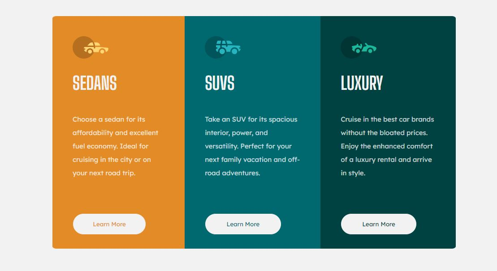

# Frontend Mentor - 3-column preview card component solution

This is a solution to the [3-column preview card component challenge on Frontend Mentor](https://www.frontendmentor.io/challenges/3column-preview-card-component-pH92eAR2-). Frontend Mentor challenges help you improve your coding skills by building realistic projects.

## Table of contents

- [Overview](#overview)
  - [The challenge](#the-challenge)
  - [Final Work](#FinalWork)
  - [Links](#links)
- [My process](#my-process)
  - [Built with](#built-with)
- [Author](#author)

## Overview

### The challenge

Users should be able to:

- View the optimal layout depending on their device's screen size
- See hover states for interactive elements

### Final Work

### Links

- Solution URL: [https://www.frontendmentor.io/solutions/3columnpreviewcardcomponent-7TXXAQ9d9](https://www.frontendmentor.io/solutions/3columnpreviewcardcomponent-7TXXAQ9d9)
- Live Site URL: [https://3-column-preview-card-component-wheat.vercel.app/](https://3-column-preview-card-component-wheat.vercel.app/)

## My process

### Built with

- Semantic HTML5 markup
- CSS custom properties
- Flexbox

## Author

- LinkedIn - [Quartey-Papafio Nii Laryea](https://www.linkedin.com/in/nii-laryea-quartey-papafio-229440176/)
- Frontend Mentor - [@Pap-Ski](https://www.frontendmentor.io/profile/Pap-Ski)
